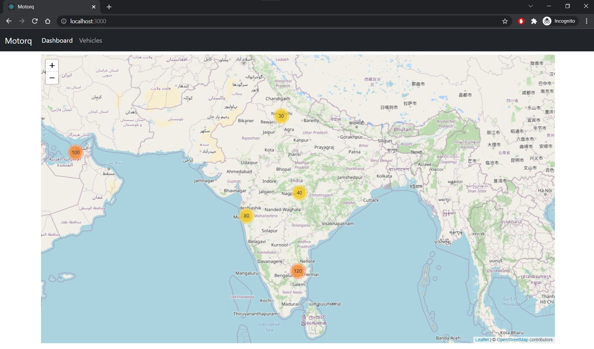
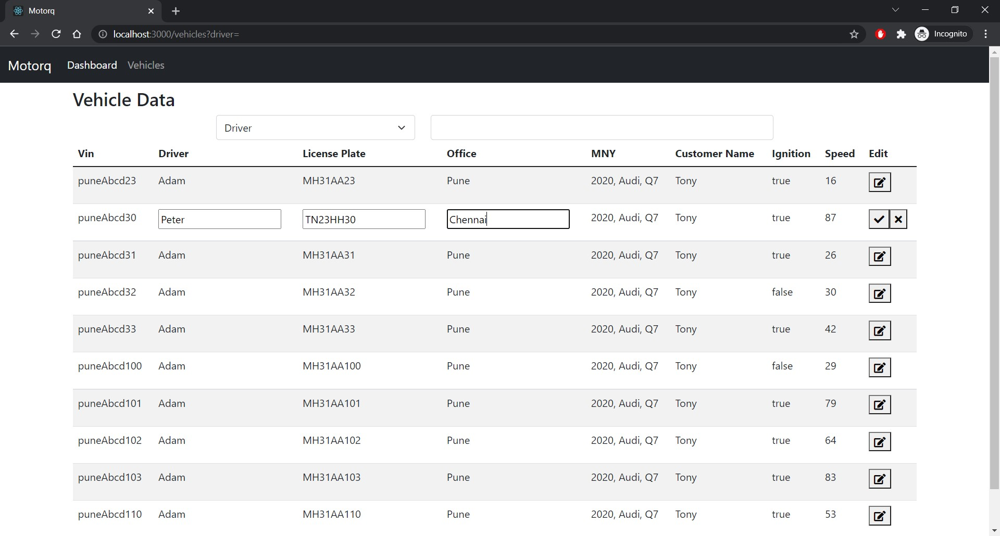

# Motorq: Vehicle Management Portal

## Made using MERN Stack

### Video Demo: [https://youtu.be/CYAhxozOpiU](https://youtu.be/CYAhxozOpiU)

# UI






# API Example

## `GET` `/api/vehicles`

Request

`http://localhost:9000/api/vehicles?count=1&vin=nagAbcd132`

Response

```json
[
  {
    "Status": {
      "location": {
        "lat": 21.235422346623213,
        "lon": 79.17057965317015
      },
      "ignition": false,
      "speed": 10
    },
    "_id": "619175fff3ba5831cabf4479",
    "Vin": "nagAbcd132",
    "LicensePlate": "MH41AA30",
    "Driver": "Sanu",
    "MMY": "2020, BMW, X5",
    "CustomerName": "Ram",
    "Office": "Nagpur",
    "__v": 0
  }
]
```

## `PATCH` `/api/vehicles/:id`

Request

`localhost:9000/api/vehicles/619173491329bf9dbfddb238`

Body

```json
{
  "licensePlate": "AA11BB1234",
  "Driver": "Rohan",
  "customerName": "Ali",
  "Office": "Chennai"
}
```

Response

```json
{
  "Status": {
    "location": {
      "lat": 18.560512231893355,
      "lon": 73.87061340023229
    },
    "ignition": true,
    "speed": 87
  },
  "_id": "619173491329bf9dbfddb238",
  "Vin": "puneAbcd30",
  "LicensePlate": "TN23HH30",
  "Driver": "Peter",
  "MMY": "2020, Audi, Q7",
  "CustomerName": "Tony",
  "Office": "Chennai",
  "__v": 0
}
```

# Run the Project

```bash
git clone https://github.com/ketan-lambat/motorq-AE-task
```

Navigate to server (backend)

```bash
$ npm i
$ npm start
```

In other terminal Navigate to client (frontend)

```bash
$ npm i
$ npm start
```

On browser
[http://localhost:3000](http://localhost:3000) will open the application
